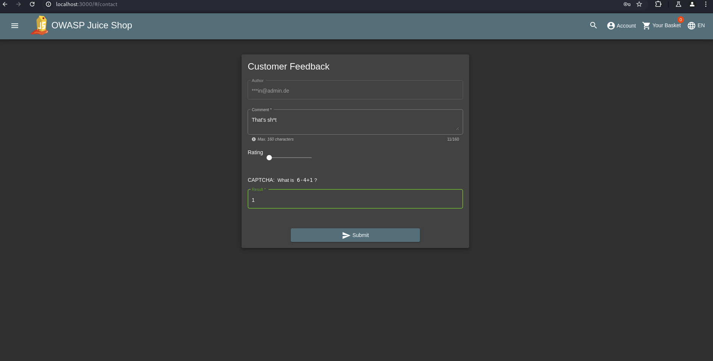
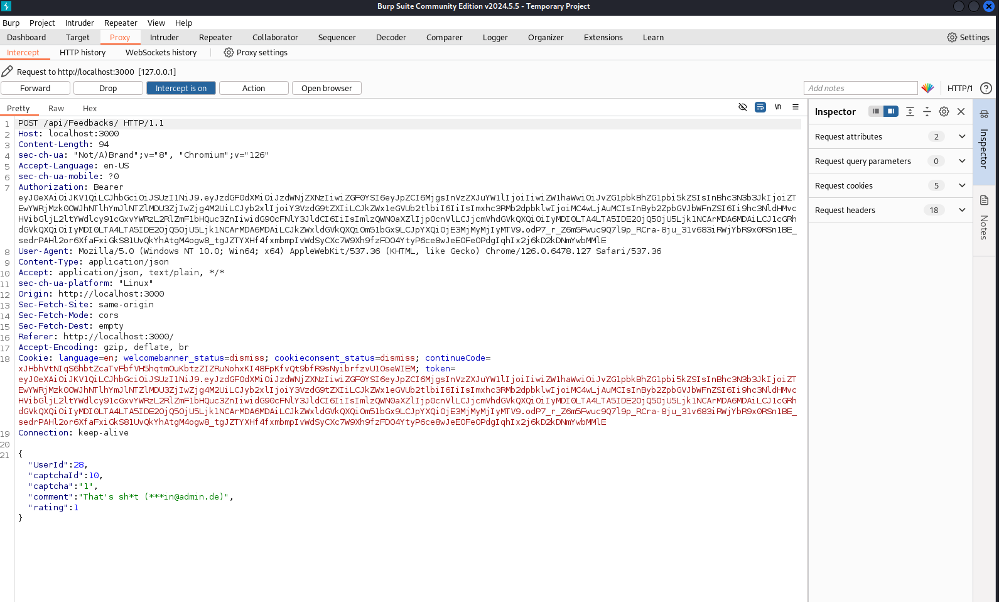

# Forged Feedback

## Type

Broken Access Control

## Description

This exploit takes advantage of an access control vulnerability to `post feedback on behalf of another user`. By `manipulating the HTTP request`, the user can change the `UserID` in the feedback form and thus post comments on behalf of `another user`.

## What do I need?

- Request
- user login
- Burpesuite

## My Way

- I log in with any account

- I go to "Customer Feedback" and enter my comment


- Now I start my Burpsuite Proxy intercept and click on submit


- I can see the Request and i can change it

    ```json
    {
        "UserId": 2,
        "captchaId": 10,
        "captcha": "1",
        "comment": "That's sh*t (***in@admin.de)",
        "rating": 1
    }
    ```

- **It worked!**
