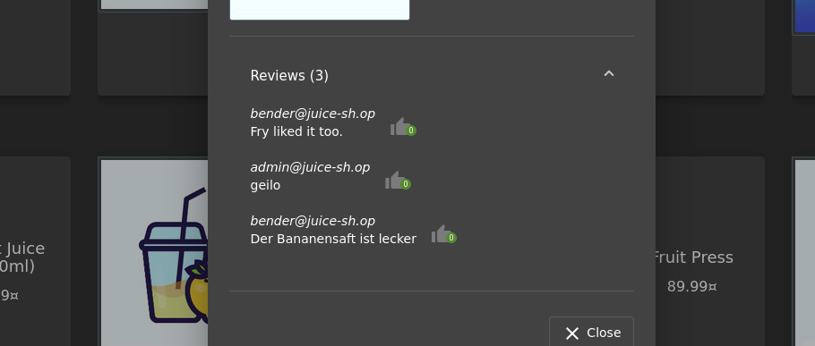
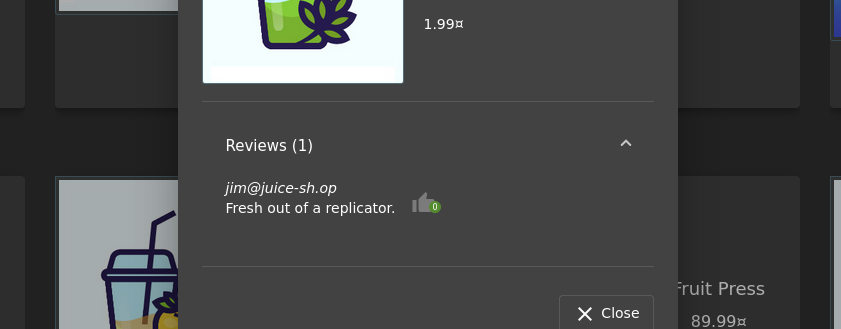
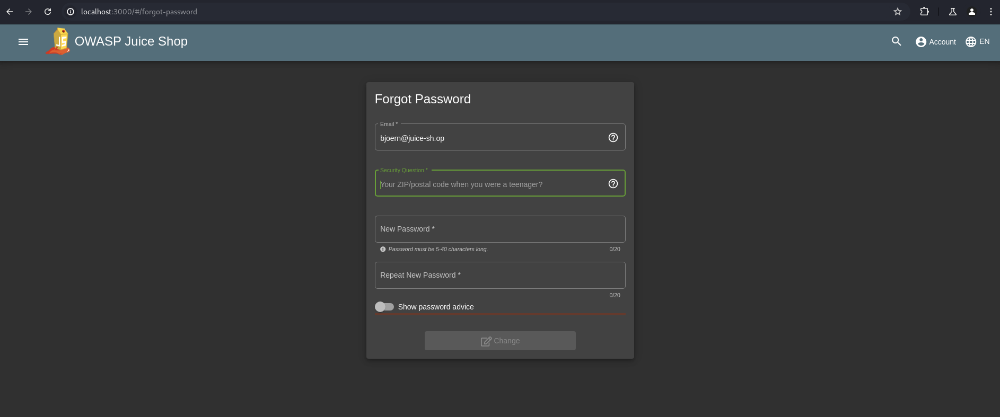
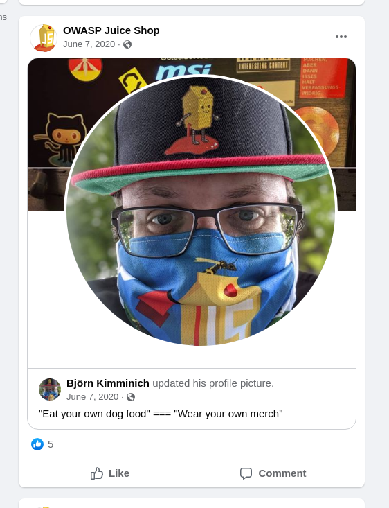
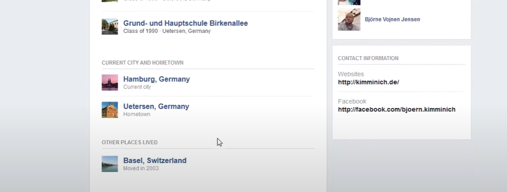
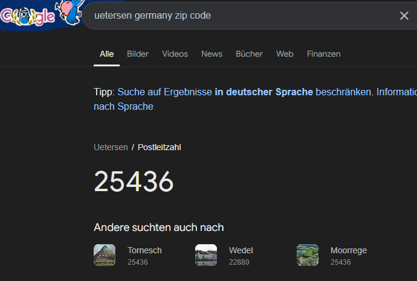
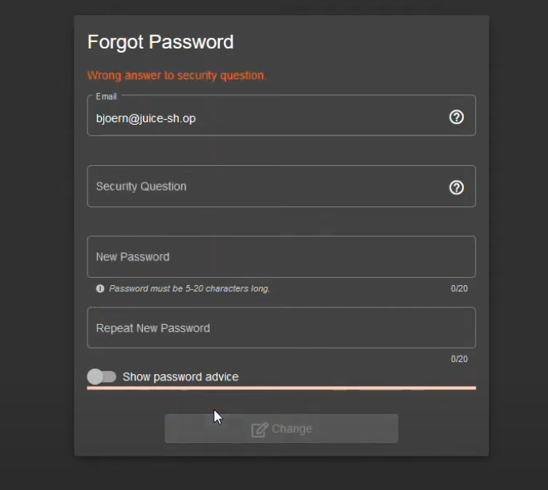
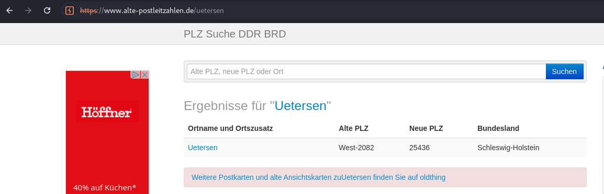

# Reset Bjoern's Password

## Type

Broken Authentication

## Description

This exploit shows how to reset `Bjoern's internal account` password via the `forgot password mechanism` by answering the `security question` using `publicly available information`.

## What do I need?

- Email
- Security answer

## My way

- I am looking for information about internal email addresses in all products

- I see a lot of the same email addresses with "**juice-sh.op**". From this I conclude that this is the internal email address and possibly the first name is packed in front of it

- I go to the URL **/forgot-password** and enter the email "**<bjoern@juice-sh.op>**".

- Now I see Björn’s **security question**
- `"Your ZIP/postal code when you were a teenager?"`

- Now I'm looking to see if I can find out more information and followed the [Facebook](https://www.facebook.com/owasp.juiceshop) link.
Then I saw the full name of "**Björn Kimminich**"

- Now I can get some information:

  - His **hometown** is **Uetersen in Germany**
  - was in **elementary school in 1990**
  - **born around 1983**

- I trying the zip code of **Uetersen**

- Ok, it's **wrong**
- I saw he was **born** around **1983**
- **1989** was the **great fall of the Berlin Wall**
- I go to [alte Postleitzahlen](https://www.alte-postleitzahlen.de/uetersen) and seach **Uetersen**

- now I'm trying the old zip code

- **It worked!** I reset the password of **<bjoern@juice-sh.op>** via the **Forgot Password** mechanism with the original answer to his security question
